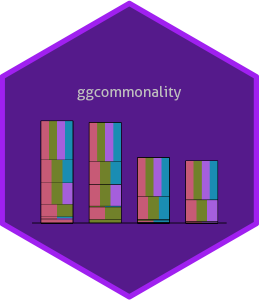

<!-- README.md is generated from README.Rmd. Please edit that file -->

```{r, include = FALSE}
knitr::opts_chunk$set(
  collapse = TRUE,
  comment = "#>",
  fig.path = "man/figures/README-",
  out.width = "100%"
)
```

# ggcommonality 

<!-- badges: start -->

<!-- badges: end -->

ggcommonality creates bar plots of unique and joint effects from a
commonality analysis of a linear regression model. The S4 branch extends
its functionality using an object-oriented syntax. The package calls on
`yhat` to perform commonality analyses [@nimon2023r], building bar plots
in the style of those appearing in the [MAPLE
Lab's](https://maplelab.net) work applying commonality analysis to the
compositions of Bach and Chopin [@delle2025breaking;
@anderson2022exploring].

Partitions are plotted sequentially in alphabetical order, starting with
unique effects and are built iteratively with joint effects at higher
orders on top.

Note: This package is a hobby project and is currently under development, so there are likely many bugs I have yet to find and fix.

## Installation

You can install ggcommonality (under development) from
[GitHub](https://github.com/) with:

``` r
devtools::install_github("cmndrsn/ggcommonality", build_vignettes = TRUE, force = TRUE)
```

## Example

The function produces a GGCommonality object, containing ingredients for
plotting commonality effects, along with the results from the
commonality analysis.

```{r example, warning=FALSE}
library(ggcommonality)

my_formula <- mpg ~ wt + hp

p <- ggcom(formula = my_formula,
                   data = mtcars)
  
p |> attributes() |> summary()
```

ggcommonality objects can be defined, plotted, and summarized using
built-in methods.

```{r}
# visualize commonality effects and add confidence intervals
plot(p) +
  ggcom_ci(p)
```

We can also check the output from the `yhat` package

```{r commonality, warning=FALSE}

ggcom_yhat(p)
```

Commonality effects can be stacked in multiple ways:

```{r warning=FALSE}

# update object 
p@stack <- 'common'

# stack
plot(p) +
  ggcom_ci(p)+
  ylim(0, 0.7)


```

```{r}
# update object 
slot(p, 'stack') <- "partition"
  
# stack
plot(p) +
  ggcom_ci(p)

```

The `ggcom_ci()` method prints confidence intervals generated for stacked
effects.

```{r}
ggcom_ci(p)
```

# Confidence intervals

The `resample_type` argument specifies whether to generate random-*x*,
confidence intervals, fixed-*x*, or wild-*x* confidence intervals. The
[appendices](https://www.john-fox.ca/Companion/) to @fox2018r summarizes
the advantages and disadvantages of fixed vs. random-*x* bootstrapping.
There is also a wild-*x* option implemented as described[here](https://stats.stackexchange.com/a/408688).

If `stack_by = "partition"`, confidence intervals represent the sum of
unique and joint effects for individual commonality partitions.
Otherwise, if `stack_by = "common"`, separate confidence intervals are
generated for the sum of unique effects and the sum of joint effects.
Confidence intervals by default for these options are based on positive coefficients, but
can be specified with an argument to `ggcom_ci()` (sign = "+" for positive coefficients, sign = "-" for negative ones, or sign = "" for both).

## Comparing confidence intervals

```{r warning=FALSE, message=FALSE}
# set r's random number generator
p1 <- ggcom(
  formula = my_formula,
  data = mtcars,
  resample_type = "fixed"
)
p2 <- ggcom(
  formula = my_formula,
  data = mtcars,
  resample_type = "wild"
)
  
library(patchwork)

# stack
plot(p1) +
  ggcom_ci(p1)+
  ylim(0,0.65)+
  ggtitle("Fixed")|
  plot(p2) +
  ggcom_ci(p2)+
    ylim(0,0.65)+
  ggtitle("Wild")

```

# Getting help

For additional details about on plotting with ggcommonality, see the 'Advanced ggcommonality' vignette:
```{r}
vignette('advanced-ggcommonality', 'ggcommonality')
```

You can also read the help documentation
`?ggcom()`, or [email me](mailto:andersoc@mcmaster.ca).

# References
