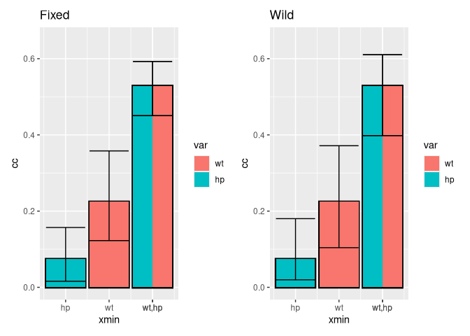

<!-- README.md is generated from README.Rmd. Please edit that file -->

# ggcommonality 

<!-- badges: start -->
<!-- badges: end -->

ggcommonality creates bar plots of unique and joint effects from a
commonality analysis of a linear regression model. The function outputs
a bar plots with unique and common effects for each commonality
partition.

The function is scalable to multiple variables and takes formula
notation for input, calling on the `yhat` package (Nimon, Oswald, and
Roberts. 2023).

This function builds bar plots in the style of those appearing in the
[MAPLE Lab’s](https://maplelab.net) work applying commonality analysis
to the compositions of Bach and Chopin (Anderson and Schutz 2022).

Partitions are plotted sequentially in alphabetical order, starting with
unique effects and are built iteratively with joint effects at higher
orders on top.

## Installation

You can install the development version of ggcommonality from
[GitHub](https://github.com/) with:

``` r
# install.packages("pak")
pak::pak("cmndrsn/ggcommonality")
```

## Example

The function produces a barplot of a commonality analysis from a formula
and data set.

``` r
library(ggcommonality)
library(ggplot2)
# import data
data(mtcars)
p <- ggcommonality(formula = mpg ~ cyl + disp + vs + drat,
                   data = mtcars)
  

print(p)
```


The plot is customizable and can be used with ggprotos.

``` r
p + 
  coord_flip() +
    geom_hline(yintercept = 0.7652,
                      linetype = "dashed",
                      color = "grey50") + # adding total explained variance
  annotate(geom="text", x=7.8, y=.71, label="Total\nvariance\nexplained\n(unique + joint)",
              color="grey50") +
  theme_minimal()
```


``` r
p + scale_fill_manual(values = c("#7fc97f",
                                          "#beaed4",
                                          "#fdc086",
                                          "#ffff99")
                              ) +
  geom_hline(yintercept = 0.7652,
                      linetype = "dashed",
                      color = "grey50") + # adding total explained variance
  annotate(geom="text", x=5, y=.76, label="Total variance explained\n(unique + joint)",
              color="grey50")
```


We can compare the bar plot output to the unique and common effects from
the model:

``` r
yhat_model <- yhat::regr(
  lm(
    formula = mpg ~ cyl + disp + vs + drat,
    data = mtcars
  )
)
knitr::kable(yhat_model$Commonality_Data$CC)
```

|                                   | Coefficient | % Total |
|:----------------------------------|------------:|--------:|
| Unique to cyl                     |      0.0235 |    3.07 |
| Unique to disp                    |      0.0248 |    3.24 |
| Unique to vs                      |      0.0001 |    0.01 |
| Unique to drat                    |      0.0047 |    0.61 |
| Common to cyl, and disp           |      0.0884 |   11.55 |
| Common to cyl, and vs             |      0.0106 |    1.39 |
| Common to disp, and vs            |      0.0000 |    0.00 |
| Common to cyl, and drat           |      0.0110 |    1.43 |
| Common to disp, and drat          |      0.0074 |    0.97 |
| Common to vs, and drat            |      0.0009 |    0.11 |
| Common to cyl, disp, and vs       |      0.1538 |   20.09 |
| Common to cyl, disp, and drat     |      0.1645 |   21.50 |
| Common to cyl, vs, and drat       |     -0.0038 |   -0.50 |
| Common to disp, vs, and drat      |      0.0011 |    0.15 |
| Common to cyl, disp, vs, and drat |      0.2783 |   36.37 |
| Total                             |      0.7652 |  100.00 |

To get the x and y coordinates passed to `geom_rect()` when making the
plot, you can use the following line of code, which returns a list with
(1) the data frame used to create the barplot for positive commonalities
(from xmin, xmax, ymin, and ymax coordinates); (2) the data frame used
to create the black outline for the positive effects; (3) the data frame
used to create the barplot for negative commonalities; and (4) the data
frame used to create the black outline for the negative effects.

``` r
df_commonality <- df_ggcommonality(formula = mpg ~ cyl + disp + vs + drat,
                   data = mtcars)

## Make output shorter
lapply(df_commonality,
       head)
#> [[1]]
#>        names   vals total category plot_order n_cues   type cue value x_min
#> 5        cyl 0.0235  3.07      cyl          1      1 unique   1   cyl   2.5
#> 1   cyl,  vs 0.0106  1.39      cyl          2      2 common   1   cyl   2.5
#> 2   cyl,  vs 0.0106  1.39      cyl          2      2 common   2    vs   3.0
#> 3 cyl,  drat 0.0110  1.43      cyl          3      2 common   1   cyl   2.5
#> 4 cyl,  drat 0.0110  1.43      cyl          3      2 common   2  drat   3.0
#> 6 cyl,  disp 0.0884 11.55      cyl          4      2 common   1   cyl   2.5
#>   x_max category_numeric  y_min  y_max
#> 5   3.5                1 0.0000 0.0235
#> 1   3.0                1 0.0235 0.0341
#> 2   3.5                1 0.0235 0.0341
#> 3   3.0                1 0.0341 0.0451
#> 4   3.5                1 0.0341 0.0451
#> 6   3.0                1 0.0451 0.1335
#> 
#> [[2]]
#> # A tibble: 4 × 6
#>   category y_min y_max x_min x_max x_mid
#>   <chr>    <dbl> <dbl> <dbl> <dbl> <dbl>
#> 1 cyl          0 0.730   2.5   3.5   3  
#> 2 disp         0 0.718   4     5     4.5
#> 3 drat         0 0.468   5.5   6.5   6  
#> 4 vs           0 0.445   7     8     7.5
#> 
#> [[3]]
#>            names    vals total category plot_order 4 n_cues   type cue value
#> 4            cyl  0.0000   0.0      cyl          1        1 unique   1   cyl
#> 1 cyl, vs,  drat -0.0038  -0.5      cyl          2        3 common   1   cyl
#> 2 cyl, vs,  drat -0.0038  -0.5      cyl          2        3 common   2    vs
#> 3 cyl, vs,  drat -0.0038  -0.5      cyl          2        3 common   3  drat
#> 7           disp  0.0000   0.0     disp          1        1 unique   1  disp
#> 5      disp,  vs  0.0000   0.0     disp          2        2 common   1  disp
#>      x_min    x_max category_numeric y_min   y_max
#> 4 2.500000 3.500000                1     0  0.0000
#> 1 2.500000 2.833333                1     0 -0.0038
#> 2 2.833333 3.166667                1     0 -0.0038
#> 3 3.166667 3.500000                1     0 -0.0038
#> 7 4.000000 5.000000                2     0  0.0000
#> 5 4.000000 4.500000                2     0  0.0000
#> 
#> [[4]]
#> # A tibble: 4 × 6
#>   category   y_min   y_max x_min x_max x_mid
#>   <chr>      <dbl>   <dbl> <dbl> <dbl> <dbl>
#> 1 cyl      -0.0038 -0.0038   2.5   3.5   3  
#> 2 disp      0       0        4     5     4.5
#> 3 drat     -0.0038 -0.0038   5.5   6.5   6  
#> 4 vs       -0.0038 -0.0038   7     8     7.5
```

# Adding confidence intervals

You can add percentile-based bootstrap confidence intervals using the
`ci_ggcommonality` function. The `resample_type` argument specifies
whether to generate random-$x$ confidence intervals or fixed-$x$
confidence intervals. The [online
appendices](https://www.john-fox.ca/Companion/) to Fox and Weisberg
(2018) provide useful explanations and examples of both types. If
`by = "partition"`, confidence intervals represent the sum of unique and
joint effects for individual commonality partitions. Otherwise, if
`by = "common"`, separate confidence intervals are generated for the sum
of unique effects and the sum of joint effects.

## Adding random-$x$ bootstrap confidence intervals

``` r
p +
  ci_ggcommonality(formula = mpg ~ cyl + disp + vs + drat,
                   data = mtcars,
                   n_replications = 100) +
    ci_ggcommonality(formula = mpg ~ cyl + disp + vs + drat,
                   data = mtcars,
                   n_replications = 100,
                   ci_sign = "-")
```



## Adding fixed-$x$ bootstrap confidence intervals

``` r
p +
  ci_ggcommonality(formula = mpg ~ cyl + disp + vs + drat,
                   data = mtcars,
                   resample_type = "fixed",
                   n_replications = 100) +
    ci_ggcommonality(formula = mpg ~ cyl + disp + vs + drat,
                   data = mtcars,
                   n_replications = 100,
                   ci_sign = "-",
                   resample_type = "fixed")
```


# Stack by unique vs. common effects

``` r
p2 <- ggcommonality(formula = mpg ~ cyl + disp + vs + drat,
                   data = mtcars,
                   by = "common")

p2 +
  ci_ggcommonality(formula = mpg ~ cyl + disp + vs + drat,
                   data = mtcars,
                   sample_column = "gear",
                   n_replications = 100,
                   by = "common",
                   colour = "grey5",
                   width = 0.5,
                   alpha = 0.5) 
```


# References

<div id="refs" class="references csl-bib-body hanging-indent">

<div id="ref-anderson2022exploring" class="csl-entry">

Anderson, Cameron J, and Michael Schutz. 2022. “Exploring Historic
Changes in Musical Communication: Deconstructing Emotional Cues in
Preludes by Bach and Chopin.” *Psychology of Music* 50 (5): 1424–42.

</div>

<div id="ref-fox2018r" class="csl-entry">

Fox, John, and Sanford Weisberg. 2018. *An r Companion to Applied
Regression*. Sage publications.

</div>

<div id="ref-nimon2023r" class="csl-entry">

Nimon, Kim, Fred Oswald, and J. Kyle Roberts. 2023. *Yhat: Interpreting
Regression Effects*. <https://CRAN.R-project.org/package=yhat>.

</div>

</div>
