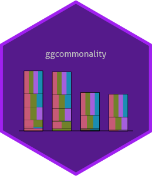

<!-- README.md is generated from README.Rmd. Please edit that file -->

# ggcommonality 

<!-- badges: start -->

<!-- badges: end -->

ggcommonality creates bar plots of unique and joint effects from a
commonality analysis of a linear regression model. The S4 branch extends
its functionality using an object-oriented syntax. The package calls on
`yhat` to perform commonality analyses (Nimon, Oswald, and Roberts.
2023), building bar plots in the style of those appearing in the [MAPLE
Lab’s](https://maplelab.net) work applying commonality analysis to the
compositions of Bach and Chopin (Delle Grazie, Anderson, and Schutz
2025; Anderson and Schutz 2022).

Partitions are plotted sequentially in alphabetical order, starting with
unique effects and are built iteratively with joint effects at higher
orders on top.

Note: This package is a hobby project and is currently under
development, so there are likely many bugs I have yet to find and fix.

## Installation

You can install ggcommonality (under development) from
[GitHub](https://github.com/) with:

``` r
devtools::install_github("cmndrsn/ggcommonality", build_vignettes = TRUE, force = TRUE)
```

## Example

The function produces a GGCommonality object, containing ingredients for
plotting commonality effects, along with the results from the
commonality analysis.

``` r
library(ggcommonality)

my_formula <- mpg ~ wt + hp

p <- ggcom(formula = my_formula,
                   data = mtcars)
#> Registered S3 method overwritten by 'mosaic':
#>   method                           from   
#>   fortify.SpatialPolygonsDataFrame ggplot2
  
p |> attributes() |> summary()
#>                Length Class      Mode     
#> data            11    data.frame list     
#> data.boot      400    -none-     numeric  
#> formula          3    formula    call     
#> stack            1    -none-     name     
#> n_replications   1    -none-     numeric  
#> sample_column    1    -none-     name     
#> resample_type    1    -none-     character
#> wild_type        1    -none-     character
#> include_total    1    -none-     logical  
#> ci_bounds        2    -none-     numeric  
#> seed             1    -none-     name     
#> ...              1    -none-     name     
#> class            1    -none-     character
```

ggcommonality objects can be defined, plotted, and summarized using
built-in methods.

``` r
# visualize commonality effects and add confidence intervals
plot(p) +
  ggcom_ci(p)
#> Warning: Using `size` aesthetic for lines was deprecated in ggplot2 3.4.0.
#> ℹ Please use `linewidth` instead.
#> ℹ The deprecated feature was likely used in the ggcommonality package.
#>   Please report the issue to the authors.
#> This warning is displayed once per session.
#> Call `lifecycle::last_lifecycle_warnings()` to see where this warning was
#> generated.
#> Bootstrapped confidence intervals:
#> # A tibble: 3 × 3
#> # Groups:   com [3]
#>   com      lci   uci
#>   <fct>  <dbl> <dbl>
#> 1 hp    0.0291 0.169
#> 2 wt    0.0830 0.346
#> 3 wt,hp 0.427  0.691
```


We can also check the output from the `yhat` package

``` r

ggcom_yhat(p)
#> $yhat
#> $yhat$LM_Output
#> 
#> Call:
#> lm(formula = x@formula, data = x@data)
#> 
#> Residuals:
#>    Min     1Q Median     3Q    Max 
#> -3.941 -1.600 -0.182  1.050  5.854 
#> 
#> Coefficients:
#>             Estimate Std. Error t value Pr(>|t|)    
#> (Intercept) 37.22727    1.59879  23.285  < 2e-16 ***
#> wt          -3.87783    0.63273  -6.129 1.12e-06 ***
#> hp          -0.03177    0.00903  -3.519  0.00145 ** 
#> ---
#> Signif. codes:  0 '***' 0.001 '**' 0.01 '*' 0.05 '.' 0.1 ' ' 1
#> 
#> Residual standard error: 2.593 on 29 degrees of freedom
#> Multiple R-squared:  0.8268, Adjusted R-squared:  0.8148 
#> F-statistic: 69.21 on 2 and 29 DF,  p-value: 9.109e-12
#> 
#> 
#> $yhat$Beta_Weights
#>         wt         hp 
#> -0.6295545 -0.3614507 
#> 
#> $yhat$Structure_Coefficients
#>              wt         hp
#> [1,] -0.9542295 -0.8536101
#> 
#> $yhat$Commonality_Data
#> $yhat$Commonality_Data$CC
#>                      Coefficient     % Total
#> Unique to wt              0.2243       27.13
#> Unique to hp              0.0740        8.94
#> Common to wt, and hp      0.5285       63.92
#> Total                     0.8268      100.00
#> 
#> $yhat$Commonality_Data$CCTotalbyVar
#>    Unique Common  Total
#> wt 0.2243 0.5285 0.7528
#> hp 0.0740 0.5284 0.6024
#> 
#> 
#> $yhat$Effect_Size
#>                     Effect.Size Recommended
#> Wherry1       0.808226750298805          No
#> Claudy3       0.824785233237495          No
#> Smith         0.808866705525839          No
#> Wherry2       0.814839620978156          No
#> Olkin & Pratt 0.818527562995977         Yes
#> Pratt         0.818271515745636          No
#> 
#> $yhat$Comment
#> [1] "The Effect Size recommendations are based on Yin and Fan (2001). Your dataset may take on a different covariance structure, thus making another effect size estimate more appropriate."
#> 
#> 
#> $ci
#>       Unique to wt         Unique to hp         Common to wt, and hp
#> 2.5%             0.0830375             0.029070            0.4274225
#> 97.5%            0.3456300             0.169165            0.6907550
#>       Total               
#> 2.5%             0.7420675
#> 97.5%            0.9258700
```

Commonality effects can be stacked in multiple ways:

``` r

# update object 
p@stack <- 'common'

# stack
plot(p) +
  ggcom_ci(p)+
  ylim(0, 0.7)
#> Bootstrapped confidence intervals:
#>         type     lower     upper
#> 2.5%  unique 0.1578475 0.4153675
#> 2.5%1 common 0.4274225 0.6907550
```


``` r
# update object 
slot(p, 'stack') <- "partition"
  
# stack
plot(p) +
  ggcom_ci(p)
#> Bootstrapped confidence intervals:
#>       category     lower     upper
#> 2.5%        wt 0.6116075 0.8537450
#> 2.5%1       hp 0.5013850 0.7596975
```


The `ggcom_ci()` method prints confidence intervals generated for
stacked effects.

``` r
ggcom_ci(p)
#> Bootstrapped confidence intervals:
#>       category     lower     upper
#> 2.5%        wt 0.6116075 0.8537450
#> 2.5%1       hp 0.5013850 0.7596975
#> mapping: x = ~x_mid, ymin = ~lower, ymax = ~upper 
#> geom_errorbar: na.rm = FALSE, orientation = NA, lineend = butt, width = 0.3
#> stat_identity: na.rm = FALSE
#> position_identity
```

# Confidence intervals

The `resample_type` argument specifies whether to generate random-*x*,
confidence intervals, fixed-*x*, or wild-*x* confidence intervals. The
[appendices](https://www.john-fox.ca/Companion/) to Fox and Weisberg
(2018) summarizes the advantages and disadvantages of fixed
vs. random-*x* bootstrapping. There is also a wild-*x* option
implemented as
described[here](https://stats.stackexchange.com/a/408688).

If `stack_by = "partition"`, confidence intervals represent the sum of
unique and joint effects for individual commonality partitions.
Otherwise, if `stack_by = "common"`, separate confidence intervals are
generated for the sum of unique effects and the sum of joint effects.
Confidence intervals by default for these options are based on positive
coefficients, but can be specified with an argument to `ggcom_ci()`
(sign = “+” for positive coefficients, sign = “-” for negative ones, or
sign = “” for both).

## Comparing confidence intervals

``` r
# set r's random number generator
p1 <- ggcom(
  formula = my_formula,
  data = mtcars,
  resample_type = "fixed"
)
p2 <- ggcom(
  formula = my_formula,
  data = mtcars,
  resample_type = "wild"
)
  
library(patchwork)

# stack
plot(p1) +
  ggcom_ci(p1)+
  ylim(0,0.65)+
  ggtitle("Fixed")|
  plot(p2) +
  ggcom_ci(p2)+
    ylim(0,0.65)+
  ggtitle("Wild")
#> # A tibble: 3 × 3
#> # Groups:   com [3]
#>   com      lci   uci
#>   <fct>  <dbl> <dbl>
#> 1 hp    0.0134 0.165
#> 2 wt    0.126  0.382
#> 3 wt,hp 0.445  0.596
#> # A tibble: 3 × 3
#> # Groups:   com [3]
#>   com      lci   uci
#>   <fct>  <dbl> <dbl>
#> 1 hp    0.0259 0.184
#> 2 wt    0.105  0.343
#> 3 wt,hp 0.429  0.606
```


# Getting help

For additional details about on plotting with ggcommonality, see the
‘Advanced ggcommonality’ vignette:

``` r
vignette('advanced-ggcommonality', 'ggcommonality')
#> Warning: vignette 'advanced-ggcommonality' not found
```

You can also read the help documentation `?ggcom()`, or [email
me](mailto:andersoc@mcmaster.ca).

# References

<div id="refs" class="references csl-bib-body hanging-indent"
entry-spacing="0">

<div id="ref-anderson2022exploring" class="csl-entry">

Anderson, Cameron J, and Michael Schutz. 2022. “Exploring Historic
Changes in Musical Communication: Deconstructing Emotional Cues in
Preludes by Bach and Chopin.” *Psychology of Music* 50 (5): 1424–42.

</div>

<div id="ref-delle2025breaking" class="csl-entry">

Delle Grazie, Max, Cameron J Anderson, and Michael Schutz. 2025.
“Breaking with Common Practice: Exploring Modernist Musical Emotion.”
*Psychology of Music*, 03057356241296852.

</div>

<div id="ref-fox2018r" class="csl-entry">

Fox, John, and Sanford Weisberg. 2018. *An r Companion to Applied
Regression*. Sage publications.

</div>

<div id="ref-nimon2023r" class="csl-entry">

Nimon, Kim, Fred Oswald, and J. Kyle Roberts. 2023. *Yhat: Interpreting
Regression Effects*. <https://CRAN.R-project.org/package=yhat>.

</div>

</div>
