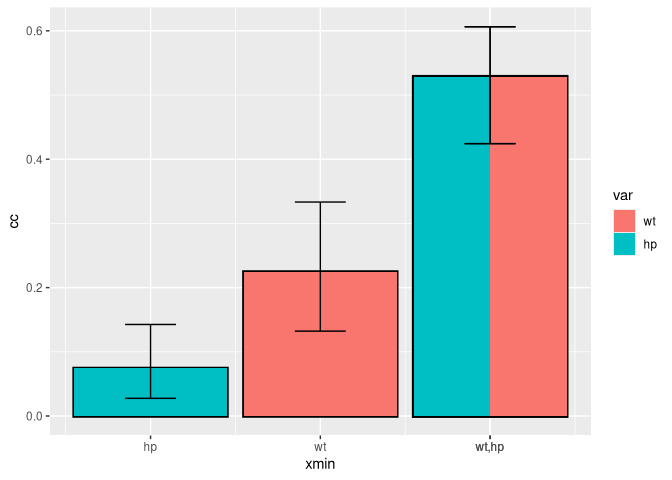

<!-- README.md is generated from README.Rmd. Please edit that file -->

# ggcommonality 

<!-- badges: start -->

<!-- badges: end -->

ggcommonality creates bar plots of unique and joint effects from a
commonality analysis of a linear regression model. The S4 branch extends
its functionality using an object-oriented syntax. The package calls on
`yhat` to perform commonality analyses (Nimon, Oswald, and Roberts.
2023), building bar plots in the style of those appearing in the [MAPLE
Lab’s](https://maplelab.net) work applying commonality analysis to the
compositions of Bach and Chopin (Anderson and Schutz 2022).

Partitions are plotted sequentially in alphabetical order, starting with
unique effects and are built iteratively with joint effects at higher
orders on top.

## Installation

You can install the S4 version of ggcommonality (under development) from
[GitHub](https://github.com/) with:

``` r
devtools::install_github("cmndrsn/ggcommonality", ref = "S4")
```

## Example

The function produces a GGCommonality object, containing ingredients for
plotting commonality effects, along with the results from the
commonality analysis.

``` r
library(ggcommonality)

my_formula <- mpg ~ wt + hp

p <- ggcommonality(formula = my_formula,
                   data = mtcars)
#> Registered S3 method overwritten by 'mosaic':
#>   method                           from   
#>   fortify.SpatialPolygonsDataFrame ggplot2
  
p |> attributes() |> summary()
#>                Length Class                      Mode     
#> data            11    data.frame                 list     
#> data.boot      400    -none-                     numeric  
#> formula          3    formula                    call     
#> stack            1    -none-                     logical  
#> stack_by         1    -none-                     character
#> n_replications   1    -none-                     numeric  
#> sample_column    1    -none-                     name     
#> resample_type    1    -none-                     character
#> wild_type        1    -none-                     character
#> include_total    1    -none-                     logical  
#> get_yhat         1    nonstandardGenericFunction function 
#> seed             1    -none-                     name     
#> ...              1    -none-                     name     
#> class            1    -none-                     character
```

ggcommonality objects can be defined, plotted, and summarized using
built-in methods.

``` r
# visualize commonality effects and add confidence intervals
plot(p) +
  add_ci(p)
#> Bootstrap confidence intervals:
#>       Unique to wt         Unique to hp         Common to wt, and hp
#> 2.5%               0.10737              0.02279            0.4454500
#> 97.5%              0.35395              0.17832            0.6077575
#>       Total               
<<<<<<< HEAD
#> 2.5%             0.7241625
#> 97.5%            0.9469150
=======
#> 2.5%             0.6974275
#> 97.5%            0.9481625
>>>>>>> 6598b34 (refactor(ggcommonality): rename core functions)
```



We can also check the results from `yhat`

``` r

get_yhat(p)
#> $yhat
#> $yhat$LM_Output
#> 
#> Call:
#> lm(formula = x@formula, data = x@data)
#> 
#> Residuals:
#>    Min     1Q Median     3Q    Max 
#> -3.941 -1.600 -0.182  1.050  5.854 
#> 
#> Coefficients:
#>             Estimate Std. Error t value Pr(>|t|)    
#> (Intercept) 37.22727    1.59879  23.285  < 2e-16 ***
#> wt          -3.87783    0.63273  -6.129 1.12e-06 ***
#> hp          -0.03177    0.00903  -3.519  0.00145 ** 
#> ---
#> Signif. codes:  0 '***' 0.001 '**' 0.01 '*' 0.05 '.' 0.1 ' ' 1
#> 
#> Residual standard error: 2.593 on 29 degrees of freedom
#> Multiple R-squared:  0.8268, Adjusted R-squared:  0.8148 
#> F-statistic: 69.21 on 2 and 29 DF,  p-value: 9.109e-12
#> 
#> 
#> $yhat$Beta_Weights
#>         wt         hp 
#> -0.6295545 -0.3614507 
#> 
#> $yhat$Structure_Coefficients
#>              wt         hp
#> [1,] -0.9542295 -0.8536101
#> 
#> $yhat$Commonality_Data
#> $yhat$Commonality_Data$CC
#>                      Coefficient     % Total
#> Unique to wt              0.2243       27.13
#> Unique to hp              0.0740        8.94
#> Common to wt, and hp      0.5285       63.92
#> Total                     0.8268      100.00
#> 
#> $yhat$Commonality_Data$CCTotalbyVar
#>    Unique Common  Total
#> wt 0.2243 0.5285 0.7528
#> hp 0.0740 0.5284 0.6024
#> 
#> 
#> $yhat$Effect_Size
#>                     Effect.Size Recommended
#> Wherry1       0.808226750298805          No
#> Claudy3       0.824785233237495          No
#> Smith         0.808866705525839          No
#> Wherry2       0.814839620978156          No
#> Olkin & Pratt 0.818527562995977         Yes
#> Pratt         0.818271515745636          No
#> 
#> $yhat$Comment
#> [1] "The Effect Size recommendations are based on Yin and Fan (2001). Your dataset may take on a different covariance structure, thus making another effect size estimate more appropriate."
#> 
#> 
#> $ci
#>       Unique to wt         Unique to hp         Common to wt, and hp
#> 2.5%               0.10737              0.02279            0.4454500
#> 97.5%              0.35395              0.17832            0.6077575
#>       Total               
#> 2.5%             0.6974275
#> 97.5%            0.9481625
```

Commonality effects can be stacked in multiple ways

``` r

# define object 
p <- ggcommonality(
  formula = my_formula,
  data = mtcars,
  stack = TRUE
)
  

# stack
plot(p) +
  add_ci(p)
#> Bootstrap confidence intervals:
#>        type     lower     upper
#> 2.5% unique 0.2549375 0.3770075
#>        type     lower   upper
#> 2.5% common 0.4284475 0.61023
```


``` r
# define object 
p <- ggcommonality(
  formula = my_formula,
  data = mtcars,
  stack = TRUE, 
  stack_by = "partition"
)
  

# stack
plot(p) +
  add_ci(p)
#> Bootstrap confidence intervals:
#>      category   lower     upper
#> 2.5%       wt 0.62849 0.8976075
#>      category    lower     upper
#> 2.5%       hp 0.405685 0.7445975
```


# Confidence intervals

The `resample_type` argument specifies whether to generate random-*x*,
confidence intervals, fixed-*x*, or wild-*x* confidence intervals. The
[appendices](https://www.john-fox.ca/Companion/) to Fox and Weisberg
(2018) summarizes the advantages and disadvantages of fixed
vs. random-*x* bootstrapping. Wild-*x* provides a solution to fixed-*x*
for models featuring heteroscedasticity by multiplying re-sampled
residuals with constants sampled from a Gaussian distribution
(`wild_type = "gaussian"`), or by randomly multiplying half by 1 and
half by -1 (`wild_type = "sign"`).

If `stack_by = "partition"`, confidence intervals represent the sum of
unique and joint effects for individual commonality partitions.
Otherwise, if `stack_by = "common"`, separate confidence intervals are
generated for the sum of unique effects and the sum of joint effects.

## Comparing confidence intervals

``` r
# set r's random number generator
p1 <- ggcommonality(
  formula = my_formula,
  data = mtcars,
  resample_type = "fixed"
)
p2 <- ggcommonality(
  formula = my_formula,
  data = mtcars,
  resample_type = "wild"
)
  
library(patchwork)

# stack
plot(p1) +
  add_ci(p1)+
  ylim(0,0.65)+
  ggtitle("Fixed")|
  plot(p2) +
  add_ci(p2)+
    ylim(0,0.65)+
  ggtitle("Wild")
#>       Unique to wt         Unique to hp         Common to wt, and hp
#> 2.5%             0.1249175            0.0214925            0.4680025
#> 97.5%            0.3549850            0.1637200            0.5915550
#>       Total               
#> 2.5%             0.7731225
#> 97.5%            0.9106050
#>       Unique to wt         Unique to hp         Common to wt, and hp
#> 2.5%             0.1249175            0.0214925            0.4680025
#> 97.5%            0.3549850            0.1637200            0.5915550
#>       Total               
#> 2.5%             0.7731225
#> 97.5%            0.9106050
#>       Unique to wt         Unique to hp         Common to wt, and hp
#> 2.5%             0.1071375             0.024800            0.4289250
#> 97.5%            0.3282025             0.173205            0.6059875
#>       Total               
#> 2.5%             0.7289525
#> 97.5%            0.9424550
#>       Unique to wt         Unique to hp         Common to wt, and hp
#> 2.5%             0.1071375             0.024800            0.4289250
#> 97.5%            0.3282025             0.173205            0.6059875
#>       Total               
#> 2.5%             0.7289525
#> 97.5%            0.9424550
```


# Getting help

For additional information, read the help documentation
`?ggcommonality()`, or [email Cameron
Anderson](mailto:andersoc@mcmaster.ca)!

# References

<div id="refs" class="references csl-bib-body hanging-indent"
entry-spacing="0">

<div id="ref-anderson2022exploring" class="csl-entry">

Anderson, Cameron J, and Michael Schutz. 2022. “Exploring Historic
Changes in Musical Communication: Deconstructing Emotional Cues in
Preludes by Bach and Chopin.” *Psychology of Music* 50 (5): 1424–42.

</div>

<div id="ref-fox2018r" class="csl-entry">

Fox, John, and Sanford Weisberg. 2018. *An r Companion to Applied
Regression*. Sage publications.

</div>

<div id="ref-nimon2023r" class="csl-entry">

Nimon, Kim, Fred Oswald, and J. Kyle Roberts. 2023. *Yhat: Interpreting
Regression Effects*. <https://CRAN.R-project.org/package=yhat>.

</div>

</div>
